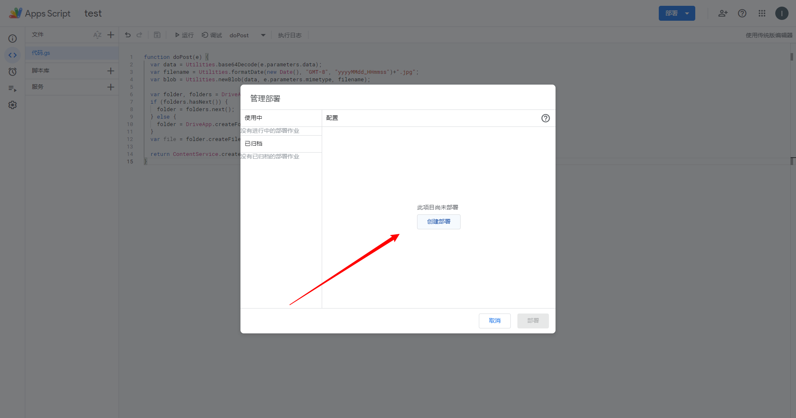
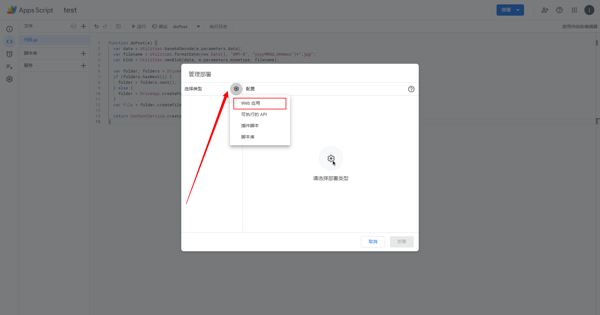
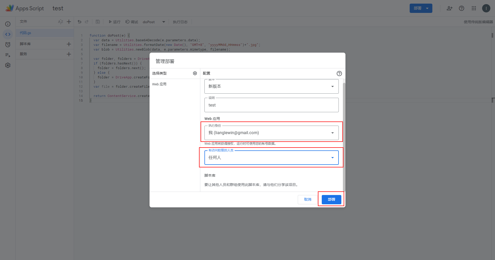
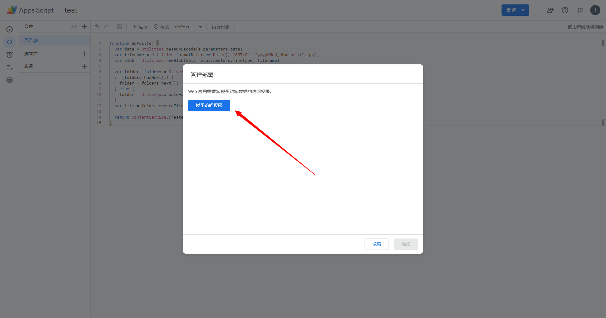
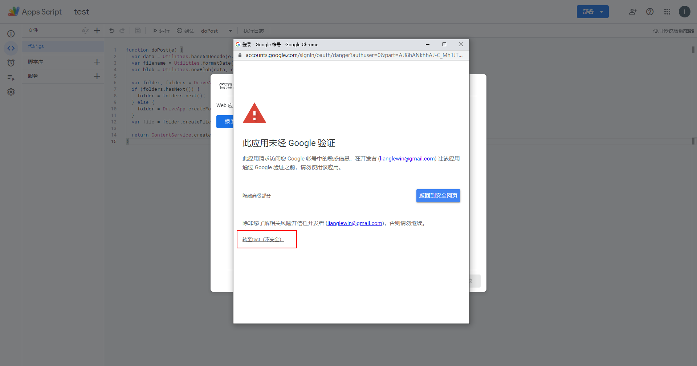
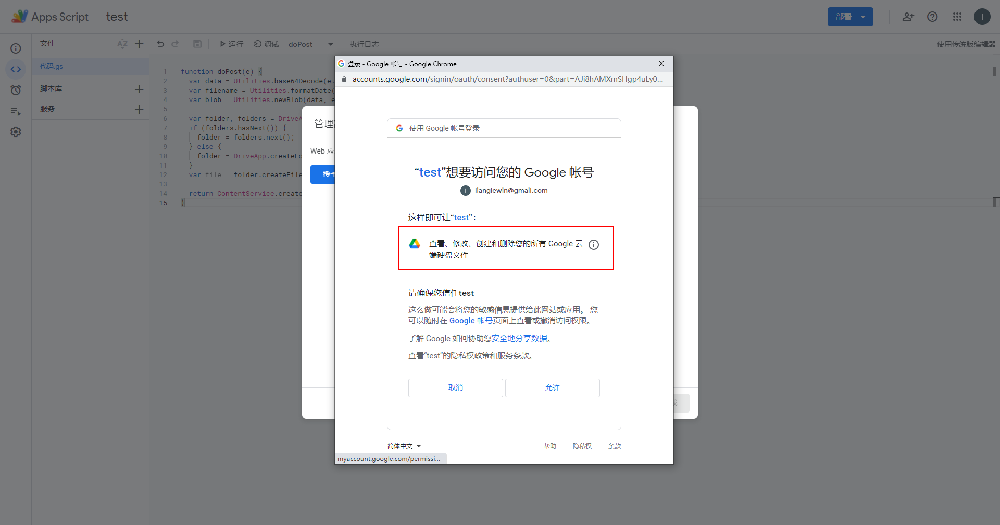

# gdrive

Upload photos taken by esp32 to Google Drive.

## Create

1. Create project


2. Rename a meaningful project name


3. Replace the code with the following, and save

```javascript
function doPost(e) {
  var data = Utilities.base64Decode(e.parameters.data);
  var filename = Utilities.formatDate(new Date(), "GMT+8", "yyyyMMdd_HHmmss")+".jpg";
  var blob = Utilities.newBlob(data, e.parameters.mimetype, filename);

  var folder, folders = DriveApp.getFoldersByName("ESP32-CAM");
  if (folders.hasNext()) {
    folder = folders.next();
  } else {
    folder = DriveApp.createFolder("ESP32-CAM");
  }
  var file = folder.createFile(blob); 

  return ContentService.createTextOutput("Completo.")
}
```

> For more development guides, please refer to https://developers.google.com/apps-script/guides/web

## Deploy

1. Go to the Manage Deployment page

    

2. Create a deployment

    

3. Choose a deployment type

    

4. Choose permissions

    

5. Grant access

    

    

    

6. Get URL

    we will get the url of this: https://script.google.com/macros/s/XXXXXXXXXXXXXX/exec

    

> Warning
>
> The entire operation above seems to make Google Drive unsafe, please use it at your own discretion.

## Test

Using Postman test results are as follows:


## esp32

The values in lines 7-9 of [gdrive.ino](./gdrive.ino) need to be modified manually.

Replace `myScript` in [gdrive.ino](./gdrive.ino) with the url obtained in [Deploy](#Deploy), `https://script.google.com` in the url do not use ` myScript`.

## Thanks

The code for the app is from [gsampallo](https://github.com/gsampallo/esp32cam-gdrive).
