# gdrive

将 esp32 拍摄的照片上传到 Google Drive。

## 创建

1. 新建项目

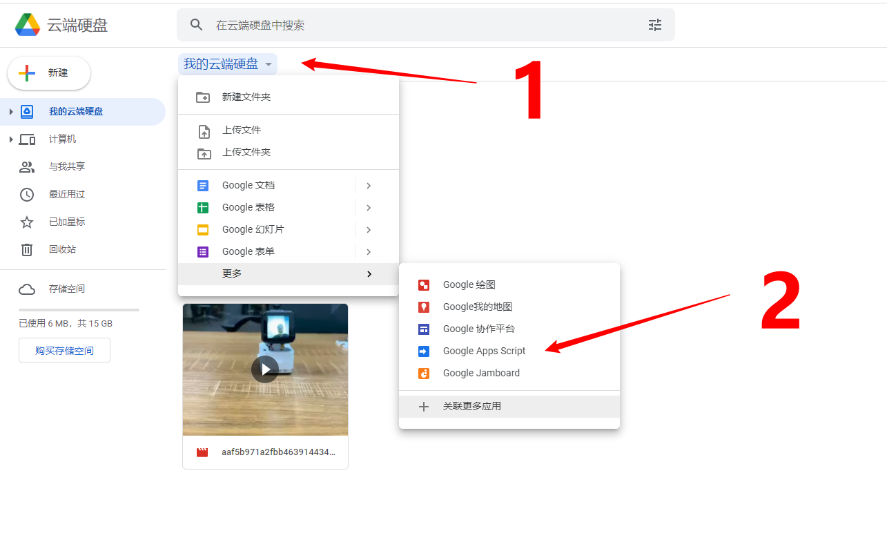

2. 起一个有意义的项目名称

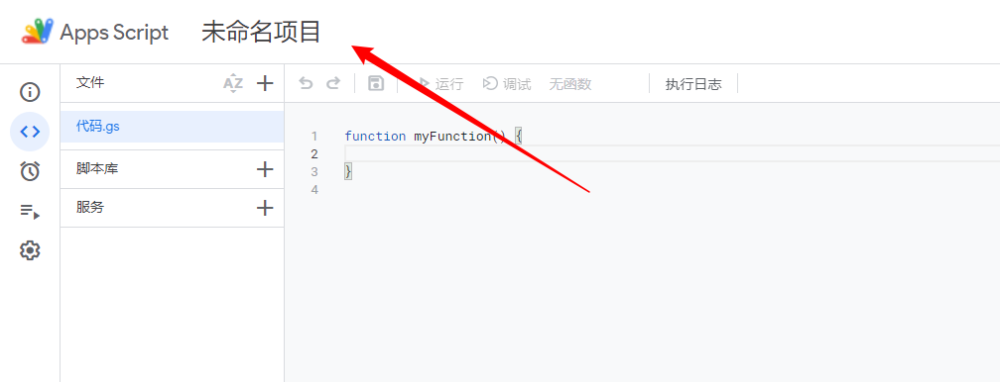

3. 将代码替换为以下内容，并保存

```javascript
function doPost(e) {
  var data = Utilities.base64Decode(e.parameters.data);
  var filename = Utilities.formatDate(new Date(), "GMT+8", "yyyyMMdd_HHmmss")+".jpg";
  var blob = Utilities.newBlob(data, e.parameters.mimetype, filename);

  var folder, folders = DriveApp.getFoldersByName("ESP32-CAM");
  if (folders.hasNext()) {
    folder = folders.next();
  } else {
    folder = DriveApp.createFolder("ESP32-CAM");
  }
  var file = folder.createFile(blob); 

  return ContentService.createTextOutput("Completo.")
}
```

> 更多开发指南，请参考 https://developers.google.com/apps-script/guides/web

## Deploy

1. 进入管理部署页面

    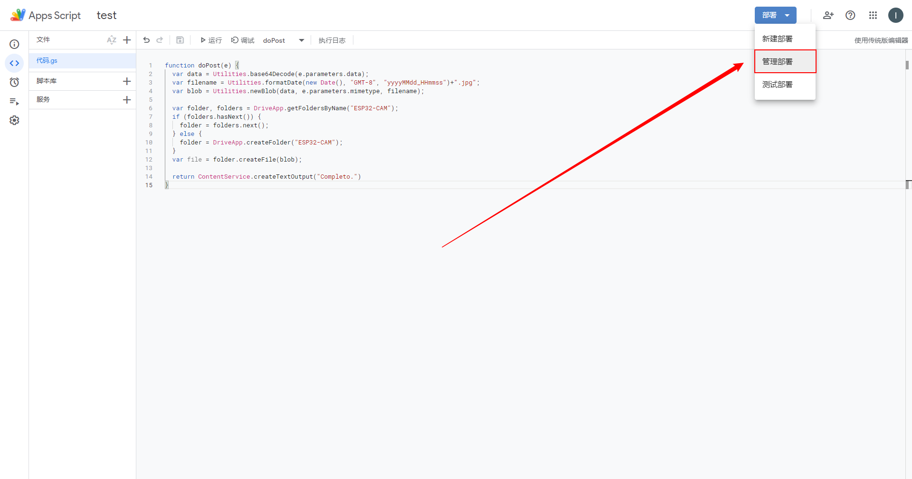

2. 新建部署

    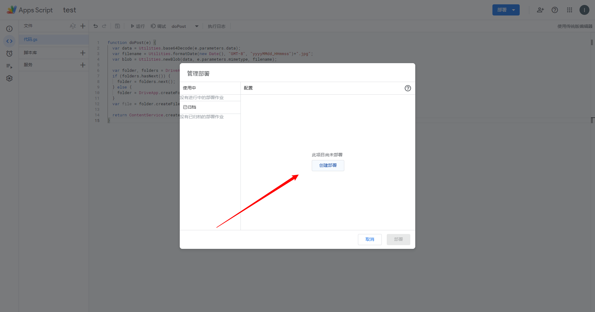

3. 选择部署类型

    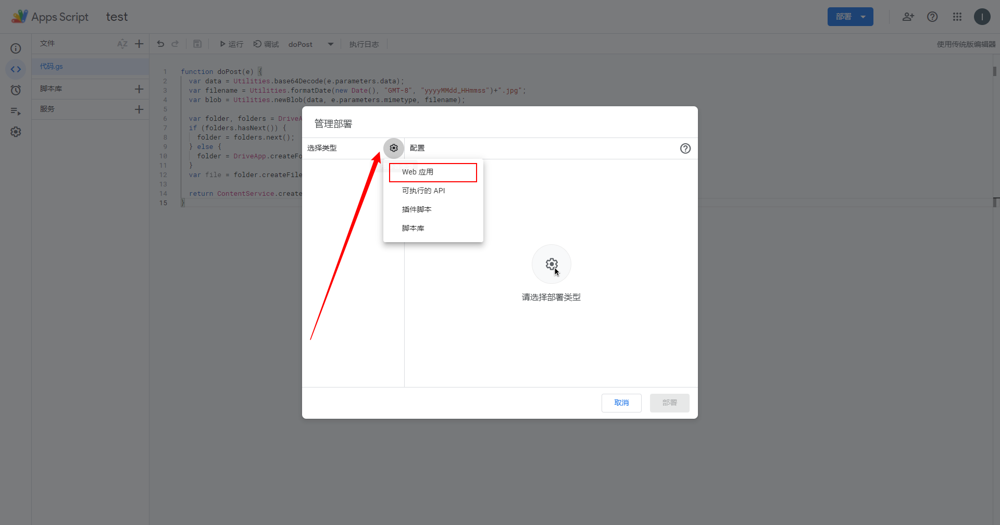

4. 选择权限

    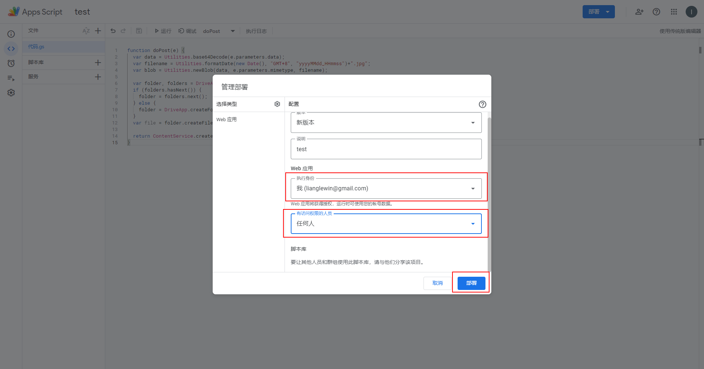

5. 授予访问权限

    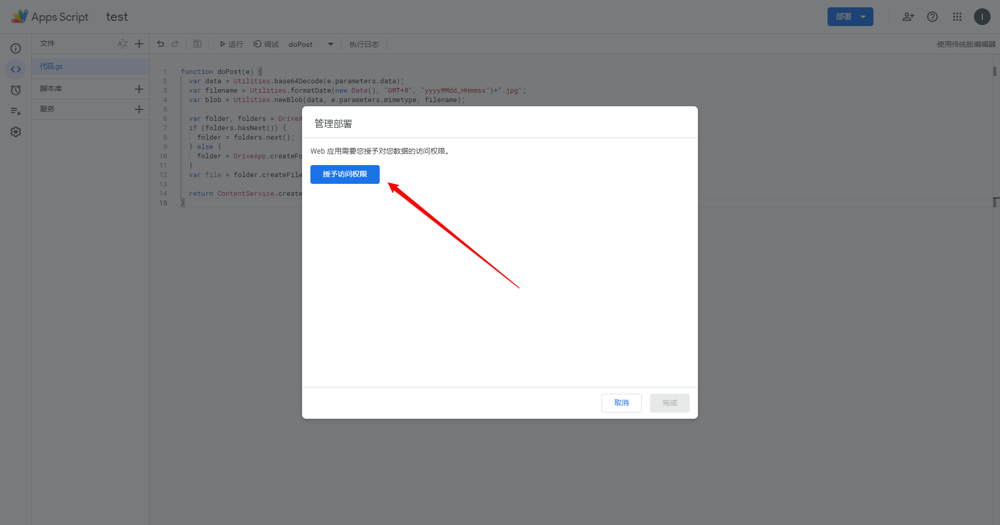

    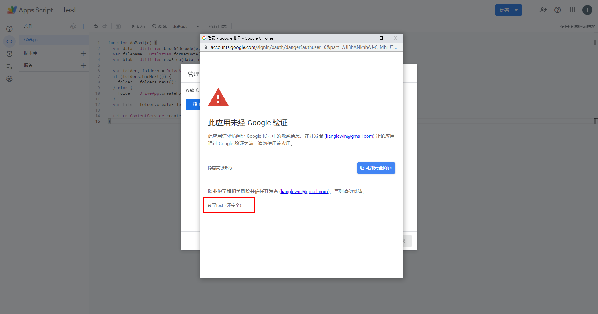

    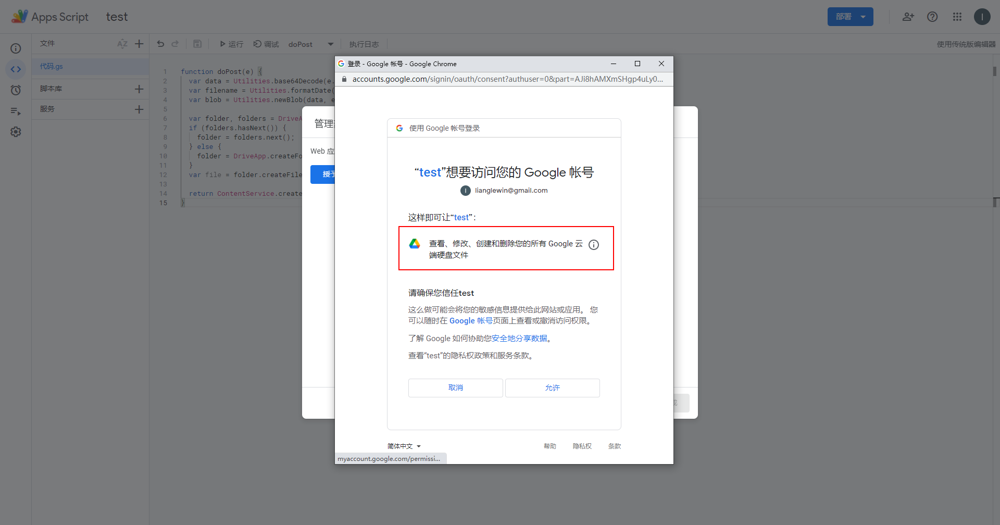

6. 获取url

    我们将会获得这个的url: https://script.google.com/macros/s/XXXXXXXXXXXXXX/exec

    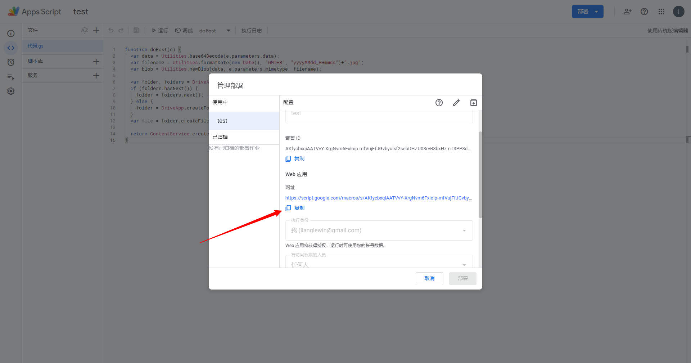

> 警告
>
> 以上整个操作似乎会导致Google Drive变的不安全，请自行斟酌使用。

## Test

使用Postman测试结果如下:

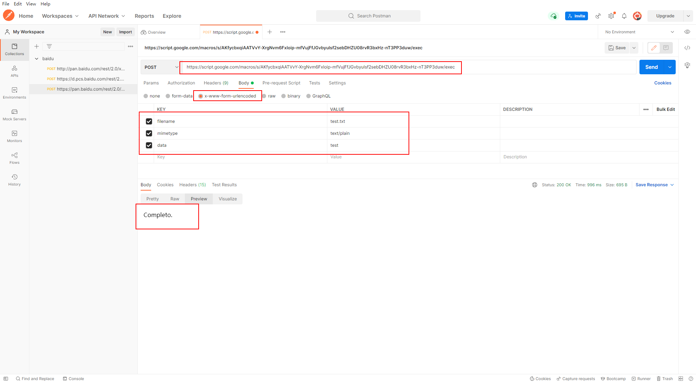

## esp32

需要手动修改 [gdrive.ino](./gdrive.ino) 的第7-9行的值。

将 [gdrive.ino](./gdrive.ino) 的 `myScript` 替换成在 [Deploy](#Deploy) 获取的url, url中的 `https://script.google.com` 不要用填入 `myScript`。

## Thanks

该应用程序的代码来自 [gsampallo](https://github.com/gsampallo/esp32cam-gdrive)。
